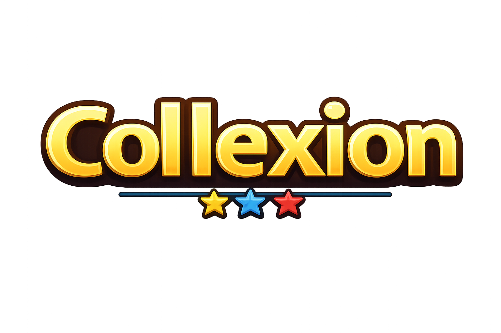

# Collexion

<div align="center">
  
  <h3>Track your retro gaming collection in one place.</h3>
</div>

[](https://expo.dev)
[](https://firebase.google.com)
[](https://reactnative.dev)

Collexion is a simple retro gaming collection app built with Expo and React Native. It helps you track consoles, handhelds, and controllers with details like condition, color, storage, and notes.

## How it works

1. Add your items with category, name, condition, color, and optional notes.
2. Browse your consoles, handhelds, and controllers in organized views.
3. Open any item to review the full details, image, and metadata.
4. Edit or delete entries anytime, and your changes sync with Firebase.

## Features

- Add new items to your collection
- Browse by category
- View item details and photo
- Edit and delete items
- Store data in Firebase

## Screenshots


## Tech Stack

- Expo
- React Native
- Firebase Firestore
- Expo Router
- TypeScript

## Getting Started

1. Install dependencies

   ```bash
   npm install
   ```

2. Start the app

   ```bash
   npx expo start
   ```

3. Open it in Expo Go or a simulator.

## Project Structure

```bash
frontend/Collexion/
├── app/
├── assets/
├── components/
├── hooks/
├── lib/
├── data/
├── package.json
├── README.md
└── firestore.rules
```

## Notes

This project is designed for gamers who want a clean and easy way to organize their retro collection.
